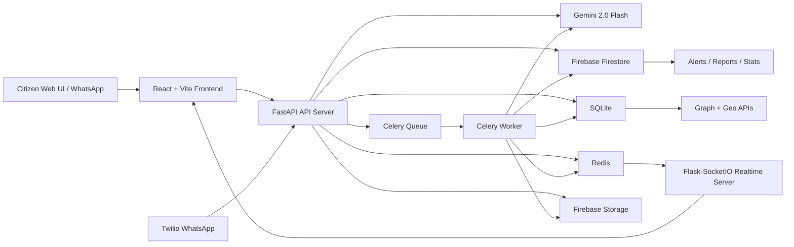

# ShieldAI Codebase Audit

This document explains ShieldAI as implemented in this repository, not just as planned in the hackathon notes. It is written so you can explain the project in an interview, defend technical choices, and identify where to extend it next.

## 1. Purpose & Positioning

### Plain-language problem

ShieldAI is an AI-assisted public-safety platform for detecting and responding to digital fraud signals early. It focuses on three related problems:

- Citizens receive scam calls/messages and need immediate guidance before they send money.
- Bank tellers, citizens, or officers may need to quickly check suspicious currency-note images.
- Law enforcement needs to convert scattered reports into intelligence: alerts, fraud networks, and geographic hotspots.

The simplest analogy: ShieldAI is a fraud "early warning radar." A single suspicious call, phone number, currency image, or citizen report becomes a signal. The system classifies it, stores it, links it to other signals, and pushes alerts to a command dashboard.

### Target users and core use cases

- Citizens: Use the web chat or WhatsApp bot to ask, "Is this a scam?" and receive calm safety guidance.
- Law enforcement: Watch live alerts, inspect fraud networks, view incident maps, and generate evidence packages.
- Bank tellers / field officers: Upload a currency note image and receive an authenticity verdict.
- Platform operators / demo judges: Seed data, run evaluations, and inspect model behavior.

### Elevator pitch

ShieldAI is an AI-powered fraud intelligence command center for India. It helps citizens detect scams in real time, checks suspicious currency notes, and turns fraud reports into live alerts, network graphs, and geographic hotspot intelligence for law enforcement.

### Technical deep-dive pitch

ShieldAI is a React/Vite frontend backed by a FastAPI API, a Flask-SocketIO realtime service, Redis pub/sub, Celery workers, SQLite, Firebase Firestore, Firebase Storage, Gemini 2.0 Flash, optional Hugging Face zero-shot classification, OpenCV image preprocessing, and NetworkX/Louvain graph analytics. Public APIs support chat, scam analysis, currency verification, reporting, and phone risk checks. Protected APIs expose law-enforcement graph and geo intelligence. Heavy work, such as image analysis and evidence package generation, is queued through Celery and tracked in a persistent SQLite task store.

## 2. Major Features

### Citizen Fraud Shield

What it does:

- Provides a chat interface for citizens to describe suspicious calls/messages.
- Supports language hints in English, Hindi/Hinglish, Telugu, and Tamil in the UI.
- Uses Gemini when configured, with a local template fallback when Gemini is unavailable.
- Maintains short chat history in Redis for session continuity.
- Rate-limits chat by IP to 10 messages per minute.
- Returns optional structured risk assessment and a report link if risk is detected.

Why it exists:

- Fraud response needs to happen while the victim is still reachable and before money is transferred.
- Many users are scared or uncertain, so the assistant emphasizes calm, direct safety instructions.

Implemented by:

- Frontend: `frontend/src/components/features/CitizenChat.jsx`
- API client: `frontend/src/services/api.js`
- Router: `backend/routers/citizen.py`
- Service: `backend/services/citizen_service.py`
- Gemini prompts/fallback: `backend/services/gemini_service.py`
- Redis config: `backend/config.py`, `docker-compose.yml`

### Citizen Fraud Reporting

What it does:

- Accepts report description, optional suspicious phone number, optional location, and optional email.
- Generates a reference number like `SAI-YYYY-000001`.
- Writes reports to Firestore when available.
- Falls back to SQLite `offline_reports` if Firestore is unavailable.
- Queues async report analysis and geocoding.
- Adds report entities to the SQLite fraud graph.

Why it exists:

- A chat warning is useful, but reports turn user experiences into reusable intelligence.

Implemented by:

- Frontend API wrapper: `frontend/src/services/api.js`
- Router: `backend/routers/citizen.py`
- Service: `backend/services/citizen_service.py`
- Async report worker: `backend/tasks/scam_tasks.py`
- SQLite schema: `backend/models/database.py`
- Task registration: `backend/celery_app.py`

### Scam Text Detection

What it does:

- Accepts text, optional source phone, and language hint.
- Uses Gemini for fraud classification when configured.
- Falls back to keyword scoring when Gemini is unavailable.
- Optionally intends to use a Hugging Face zero-shot classifier.
- Computes a risk score and label.
- Creates high-risk alerts.
- Auto-adds extracted phone/account entities into the graph.

Why it exists:

- Digital arrest, KYC, customs, and investment scams follow repeated scripts. Classifying the script early can prevent victimization.

Implemented by:

- Router: `backend/routers/scam.py`
- Orchestrator: `backend/services/scam_detector.py`
- Gemini prompt/fallback: `backend/services/gemini_service.py`
- Alerts: `backend/services/alert_service.py`
- Graph insertion: `backend/services/graph_service.py`
- Schemas: `backend/models/schemas.py`

Important caveat:

- `backend/services/scam_detector.py` references `TRANSFORMERS_AVAILABLE`, which is not defined. With `ENABLE_ZERO_SHOT=false`, Python short-circuits and avoids the bug. With `ENABLE_ZERO_SHOT=true`, construction can fail. There is also a newer `backend/services/zero_shot_classifier.py` and `backend/services/risk_fusion_service.py`, but the main `ScamDetector` is not fully integrated with them.

### Scam Audio Analysis

What it does:

- Accepts uploaded audio files.
- Validates MIME type and size.
- Uses Gemini audio capabilities for transcription.
- Runs the transcript through text scam analysis.

Why it exists:

- Scam calls are often voice-based; turning audio into text lets the existing text classifier handle them.

Implemented by:

- Router: `backend/routers/scam.py`
- Audio transcription: `backend/services/gemini_service.py`
- Scam pipeline: `backend/services/scam_detector.py`

Limitations:

- Audio requires Gemini availability. The code raises a 503 if Gemini is unavailable.
- WhatsApp audio support currently returns "coming soon" rather than processing media.

### WhatsApp Webhook

What it does:

- Receives Twilio WhatsApp webhook messages.
- Validates Twilio signatures when credentials are real.
- Implements simple commands: help, report, check phone number.
- Routes general messages into Citizen Fraud Shield chat.
- Uses Redis idempotency by `MessageSid` to ignore duplicates.
- Returns TwiML XML responses to Twilio.

Why it exists:

- WhatsApp is a practical citizen channel for India; users do not need to install a new app.

Implemented by:

- Router: `backend/routers/webhook.py`
- Citizen service: `backend/services/citizen_service.py`
- Phone risk service: `backend/services/phone_risk_service.py`
- Twilio dependency: `backend/requirements.api.txt`

### Counterfeit Currency Verification

What it does:

- Lets a user upload a banknote image and choose denomination.
- Validates image format and size.
- Creates a persistent async task in SQLite.
- Uploads the image to Firebase Storage.
- Queues a Celery worker task.
- Worker downloads image, checks quality, preprocesses with OpenCV, and sends to Gemini Vision.
- Returns verdict, confidence, failed features, analysis, and alert status.
- Frontend polls for task status.

Why it exists:

- Manual FICN detection is error-prone. The project positions camera + AI as a fast triage tool.

Implemented by:

- Frontend: `frontend/src/components/features/CurrencyChecker.jsx`
- API client: `frontend/src/services/api.js`
- Router: `backend/routers/currency.py`
- Analyzer: `backend/services/currency_analyzer.py`
- Image quality: `backend/services/image_quality_service.py`
- Storage: `backend/services/storage_service.py`
- Celery task: `backend/tasks/currency_tasks.py`
- Task store: `backend/models/task_store.py`
- Gemini Vision prompt: `backend/services/gemini_service.py`

Limitations:

- The frontend has a local simulator if the verification API is offline.
- The backend does not appear to persist completed verification results into the Firestore `currency_checks` collection, but `/api/currency/stats` and `/api/currency/ficn-map` read from that collection. Those endpoints are likely driven by seeded/external data rather than new uploads.

### Live Alerting

What it does:

- Creates alert records in Firestore when possible.
- Publishes alerts to Redis channel `new_alerts`.
- Stores recent alerts in Redis as a fallback.
- Realtime server subscribes to Redis and emits Socket.IO events.
- Frontend dashboard shows alert feed and toast notifications.

Why it exists:

- Law enforcement dashboards should not poll every few seconds; they need push alerts for high-risk events.

Implemented by:

- Alert service: `backend/services/alert_service.py`
- Realtime server: `backend/realtime_server.py`
- Socket hook: `frontend/src/hooks/useSocket.js`
- Alert UI: `frontend/src/components/layout/AlertFeed.jsx`
- Toast orchestration: `frontend/src/App.jsx`
- Redis service: `docker-compose.yml`

### Law-Enforcement Dashboard

What it does:

- Provides a dashboard mode separate from the citizen view.
- Shows live alert feed.
- Shows geospatial map.
- Shows fraud network graph.
- Toasts high-risk alerts.

Why it exists:

- This is the command-center surface: it turns raw reports into operational awareness.

Implemented by:

- App shell: `frontend/src/App.jsx`
- Top navigation: `frontend/src/components/layout/TopBar.jsx`
- Alert feed: `frontend/src/components/layout/AlertFeed.jsx`
- Map: `frontend/src/components/features/GeospatialMap.jsx`
- Graph: `frontend/src/components/features/FraudNetworkGraph.jsx`
- API client: `frontend/src/services/api.js`

Authentication caveat:

- Backend protects `/api/graph` and `/api/geo` with Firebase Bearer-token auth.
- The frontend only checks that `localStorage.auth_token` exists before changing view; `api.js` does not attach the token to Axios requests. As implemented, protected dashboard data calls will receive 401 unless an Authorization interceptor is added.

### Fraud Network Graph

What it does:

- Stores fraud entities in SQLite: phones, accounts, devices, victims, suspects.
- Stores relationships such as `called`, `transacted_with`, `same_device`, `mule_for`.
- Uses NetworkX and Louvain community detection to assign cluster IDs.
- Computes central nodes based on betweenness centrality or degree.
- Serves graph nodes/edges/clusters to the frontend.
- Supports entity lookup and graph-depth traversal.
- Generates evidence package tasks for clusters.

Why it exists:

- Individual complaints can look isolated. A graph shows repeated phone numbers, mule accounts, victims, and central actors.

Implemented by:

- Router: `backend/routers/graph.py`
- Service: `backend/services/graph_service.py`
- SQLite schema: `backend/models/database.py`
- Evidence service: `backend/services/evidence_service.py`
- Graph tasks: `backend/tasks/graph_tasks.py`
- Frontend graph: `frontend/src/components/features/FraudNetworkGraph.jsx`

Implementation detail:

- The planning docs mention D3, but the actual frontend uses an SVG layout plus `react-zoom-pan-pinch`, not D3.

### Evidence Package Generation

What it does:

- Queues evidence package generation for a fraud cluster.
- Reads cluster, entities, relationships, and linked Firestore reports.
- Masks phone numbers and redacts emails/phone numbers from descriptions.
- Computes summary counts and key findings.
- Uses Gemini to synthesize a forensic report when available.
- Adds chain-of-custody metadata and an HMAC-style digital signature.
- Stores result in SQLite task store.

Why it exists:

- Law enforcement needs a structured package, not just a visualization.

Implemented by:

- Router: `backend/routers/graph.py`
- Service: `backend/services/evidence_service.py`
- Gemini evidence prompt: `backend/services/gemini_service.py`
- Task store: `backend/models/task_store.py`
- Celery task: `backend/tasks/graph_tasks.py`

Security caveat:

- `evidence_service.py` reads `settings.SECRET_KEY`, but `SECRET_KEY` is not defined in `backend/config.py`. Because pydantic settings ignores undeclared extras, this likely always uses the default development secret. A real production signature key should be added to `Settings`.

### Geospatial Intelligence

What it does:

- Reads incidents from SQLite.
- Filters incidents by type, days, and state.
- Groups incidents by rounded coordinates for heatmap-style points.
- Detects city-level hotspots by incident count and severity ratio.
- Returns per-city stats.
- Frontend renders an India map with Leaflet/CARTO dark tiles.

Why it exists:

- Fraud patterns are spatial. Maps help prioritize awareness drives, cyber cell staffing, and inter-district coordination.

Implemented by:

- Router: `backend/routers/geo.py`
- Service: `backend/services/geo_service.py`
- Frontend map: `frontend/src/components/features/GeospatialMap.jsx`
- SQLite `incidents` table: `backend/models/database.py`
- Incident creation from reports: `backend/tasks/scam_tasks.py`

Implementation detail:

- Planning docs mention GeoPandas/Nominatim, but the actual code uses SQLite aggregation and an offline dictionary of Indian city coordinates in `backend/tasks/scam_tasks.py`.

### Phone Number Risk API

What it does:

- Validates Indian phone numbers using `phonenumbers`.
- Looks up phone numbers in SQLite graph entities.
- Checks Firestore fraud reports with `array_contains`.
- Returns risk score, risk label, report count, last reported time, fraud types, graph membership, cluster ID, and centrality flag.

Why it exists:

- Banks, telecom providers, or a WhatsApp command can quickly ask, "Has this number shown up before?"

Implemented by:

- Router: `backend/routers/risk.py`
- Service: `backend/services/phone_risk_service.py`
- Schema validation: `backend/models/schemas.py`
- WhatsApp command integration: `backend/routers/webhook.py`

### Health, Diagnostics, and Evaluation

What it does:

- `/health` checks uptime, Gemini availability, SQLite, and Firestore.
- `/health/ml` checks Gemini, zero-shot, OpenCV, NumPy, Torch, and Transformers availability.
- Scripts check ML stack, seed data, test APIs, and run model evaluation.
- CI installs backend/frontend dependencies and runs pytest/build.

Implemented by:

- App health: `backend/main.py`
- Diagnostic script: `backend/scripts/check_ml_stack.py`
- API test script: `backend/scripts/run_test_api.py`
- Evaluation: `backend/evaluation/run_model_eval.py`, `backend/evaluation/scam_eval.py`
- CI: `.github/workflows/ci.yml`

## 3. Architecture & Data Flow

### High-level architecture



### Component responsibilities

- React frontend: User interaction, chat, file upload, map, graph, alert feed.
- FastAPI backend: REST APIs, validation, auth, middleware, orchestration.
- Flask-SocketIO realtime server: Push alert stream to dashboard clients.
- Redis: Celery broker/result backend, realtime pub/sub, chat history, idempotency, alert fallback cache.
- Celery worker: Long-running work such as currency verification, graph recompute, evidence packages, report post-processing.
- SQLite: Local relational store for graph, incidents, async tasks, offline reports, currency feature failures.
- Firestore: Cloud document store for reports, alerts, currency checks, scripts, aggregate stats.
- Firebase Storage: Cloud file store for uploaded note images.
- Gemini: Primary AI engine for scam text, citizen chat, currency vision, audio transcription, and evidence synthesis.
- Hugging Face/Transformers: Optional local zero-shot scam classifier.
- OpenCV/NumPy: Currency image quality checks and preprocessing.

### End-to-end flow: citizen chat

1. User types in `CitizenChat.jsx`.
2. Frontend calls `POST /api/citizen/chat` via `api.sendChatMessage`.
3. `citizen.py` validates with Pydantic schema.
4. `CitizenService.chat` rate-limits by IP in Redis and loads recent chat history.
5. `GeminiService.chat_response` sends prompt to Gemini or falls back to template responses.
6. Service saves user/assistant messages back to Redis.
7. Frontend renders assistant response and optional risk assessment.

### End-to-end flow: high-risk scam text

1. Client calls `POST /api/scam/analyze`.
2. `ScamDetector.analyze_text` asks Gemini to classify text.
3. Optional zero-shot scoring is intended but currently fragile because of the undefined symbol issue.
4. Risk score and label are computed.
5. If HIGH, `AlertService.create_alert` writes Firestore alert and publishes to Redis.
6. `GraphService.add_report_to_graph` adds phone/account/victim nodes and queues graph recompute.
7. Realtime server receives Redis alert and emits `new_alert` / `alert_feed_update`.
8. Frontend `useSocket` receives alert and updates feed/toast.

### End-to-end flow: currency verification

1. User picks file and denomination in `CurrencyChecker.jsx`.
2. Frontend posts multipart form to `POST /api/currency/verify`.
3. Router validates MIME type, size, emptiness, and denomination.
4. `CurrencyAnalyzer.start_verification` creates SQLite task.
5. Image uploads to Firebase Storage.
6. Celery task `verify_currency_task` starts.
7. Worker downloads image, runs image quality checks, preprocesses with OpenCV, and calls Gemini Vision.
8. Worker records failed features, creates FICN alert if suspicious/counterfeit, and writes task result.
9. Frontend polls `GET /api/currency/result/{task_id}` every 2 seconds.
10. Result appears with verdict, confidence, failed features, and narrative.

### End-to-end flow: citizen report to map/graph

1. User submits report through `POST /api/citizen/report`.
2. Report is saved to Firestore or offline SQLite.
3. A Celery task `process_citizen_report_task` is queued.
4. Graph nodes/edges are added immediately in SQLite.
5. Worker loads report, runs scam analysis, geocodes location via local city dictionary, updates Firestore report.
6. Worker inserts incident into SQLite `incidents`.
7. Geo endpoints read incident rows and frontend map renders them.

### End-to-end flow: evidence package

1. Officer calls `POST /api/graph/evidence-package/{cluster_id}`.
2. API creates SQLite task and queues Celery.
3. Worker gathers cluster data from SQLite and linked reports from Firestore.
4. Sensitive values are masked/redacted.
5. Gemini generates narrative synthesis, or fallback text is used.
6. Chain-of-custody metadata and signature are added.
7. Officer polls `GET /api/graph/evidence-package/result/{task_id}`.

## 4. Tech Stack and Why

### Frontend

- JavaScript: The browser language used for all frontend code.
- React: Component framework for reusable UI pieces like chat, map, graph, and alert feed.
- Vite: Fast development/build tool for React apps. Used by `frontend/package.json`.
- Axios: HTTP client used in `frontend/src/services/api.js`.
- Socket.IO client: Browser client for realtime alert events.
- Leaflet / React-Leaflet: Interactive maps in `GeospatialMap.jsx`. Reasonable because OpenStreetMap/CARTO tiles are low-cost and easy to integrate.
- Lucide React: Icon set used across the UI.
- React Zoom Pan Pinch: Used for zoom/pan behavior in the SVG fraud graph.

Tradeoffs:

- Frontend styling is mostly inline styles plus `index.css`, which is quick for a hackathon but harder to maintain than a formal design system.
- Protected API calls currently lack Bearer token injection.

### Backend API

- Python: Main backend language. Strong ecosystem for AI, data, web APIs, and scripting.
- FastAPI: Modern Python API framework with automatic validation and OpenAPI docs. Used in `backend/main.py` and routers.
- Pydantic / pydantic-settings: Typed request/response schemas and environment configuration.
- Uvicorn: ASGI server that runs FastAPI.
- python-multipart / aiofiles: File-upload support for audio/images.
- Structlog: Structured JSON logs for production-style observability.

Tradeoffs:

- FastAPI docs are disabled unless `DEBUG=true`, but README says `/docs` is available. That mismatch should be clarified.

### Realtime and async work

- Redis: Message broker, pub/sub channel, chat history cache, idempotency keys, and fallback alert cache.
- Celery: Background task queue for expensive work.
- Flask-SocketIO: Realtime alert push server.
- Eventlet / threading mode: The realtime server currently configures Socket.IO `async_mode="threading"` while the dependency includes eventlet.

Why this is reasonable:

- The API stays responsive while image analysis and evidence generation happen in workers.
- Redis lets services communicate without tight coupling.

### Data stores

- SQLite: Local relational database for graph data, incidents, tasks, offline reports, and local demo data. Good for hackathon/local deployments because it is simple and file-based.
- Firebase Firestore: Cloud document database for reports, alerts, stats, and scripts. Good fit for flexible JSON-like records.
- Firebase Storage: Stores uploaded image bytes outside the API container.

Tradeoffs:

- SQLite works well locally but is not ideal for multiple horizontally scaled writers.
- Firestore + SQLite means data is split; you must know which store owns which feature.

### AI / ML

- Gemini 2.0 Flash: Primary AI model for text classification, chat, vision, audio transcription, and evidence synthesis.
- Hugging Face Transformers + Torch: Optional local zero-shot classifier using `facebook/bart-large-mnli`.
- OpenCV + NumPy: Image quality checks and preprocessing before vision analysis.
- NetworkX + python-louvain: Graph construction, centrality, and community detection.
- phonenumbers: Indian phone-number validation and normalization.

Why this is reasonable:

- Gemini reduces the need to host multiple specialized models.
- Local fallbacks make demos resilient.
- NetworkX/Louvain are standard tools for graph intelligence.

Tradeoffs:

- Gemini is an external dependency and requires a valid API key.
- Local zero-shot models are large and slower on CPU.
- Some planned ML pieces in docs, such as GeoPandas, D3, Whisper, Detoxify, and SpeechBrain, are not in the implemented dependency stack.

## 5. Dependencies & Config

### Frontend dependencies

From `frontend/package.json`:

- UI/runtime: `react`, `react-dom`
- Build tooling: `vite`, `@vitejs/plugin-react`
- HTTP: `axios`
- Realtime: `socket.io-client`
- Maps: `leaflet`, `react-leaflet`
- Graph interaction: `react-zoom-pan-pinch`
- Icons: `lucide-react`

### Backend dependency groups

Base:

- `pydantic`, `pydantic-settings`, `python-dotenv`, `structlog`, `redis`, `firebase-admin`

API:

- `fastapi`, `uvicorn`, `python-multipart`, `aiofiles`, `google-genai`, `phonenumbers`, `twilio`, `networkx`, `python-louvain`, `celery`, `tenacity`

Worker:

- `celery`, `transformers`, `torch`, `opencv-python-headless`, `numpy`, `google-genai`, `tenacity`, `networkx`, `python-louvain`

Realtime:

- `flask`, `flask-socketio`, `flask-cors`, `eventlet`

Dev/test:

- `pytest`, `pytest-asyncio`, `httpx`

### Important environment variables

Core:

- `SQLITE_DB_PATH`: SQLite file path.
- `GEMINI_API_KEY`: Enables Gemini.
- `GEMINI_MODEL`: Defaults to `gemini-2.0-flash`.
- `LOG_LEVEL`, `DEBUG`, `HOST`, `PORT`.

Firebase:

- `FIREBASE_CREDENTIALS_B64`: Preferred env-based service account injection.
- `FIREBASE_CREDENTIALS_JSON`: Alternative env-based JSON injection.
- `FIREBASE_CREDENTIALS_PATH`: Local file fallback.
- `FIREBASE_STORAGE_BUCKET`: Required for currency image uploads.

AI/ML:

- `ENABLE_ZERO_SHOT`
- `ZERO_SHOT_MODEL`
- Legacy aliases supported: `ENABLE_BERT`, `BERT_MODEL`

Uploads:

- `MAX_UPLOAD_SIZE_MB`
- `ALLOWED_IMAGE_TYPES`
- `ALLOWED_AUDIO_TYPES`

Rate limiting/tasks:

- `RATE_LIMIT_REQUESTS`
- `RATE_LIMIT_WINDOW_SECONDS`
- `TASK_TTL_HOURS`
- `TASK_STALE_TIMEOUT_MINUTES`

Realtime/Redis:

- `REDIS_URL`
- `REALTIME_AUTH_TOKEN`

Twilio:

- `TWILIO_ACCOUNT_SID`
- `TWILIO_AUTH_TOKEN`
- `TWILIO_WHATSAPP_NUMBER`

Frontend:

- `VITE_API_URL`
- `VITE_REALTIME_URL`
- `VITE_FIREBASE_API_KEY`
- `VITE_FIREBASE_PROJECT_ID`

Config caveats:

- `.env.example` has `CORS_ORIGINS=http://localhost:3000,http://localhost:5173`, while the frontend runs on `5174`. `backend/config.py` defaults include `5174`, but copying `.env.example` exactly may override that and cause local CORS issues.
- `SECRET_KEY` is used by evidence signing but not declared in `Settings`.
- `backend/firebase-credentials.json` exists locally in this workspace and is ignored. It should not be opened, printed, or committed.

## 6. Deployment & Usage

### Local via Docker Compose

Recommended command:

```bash
docker-compose up --build
```

Services:

- API: `http://localhost:8000`
- Realtime server: `http://localhost:5001`
- Frontend: `http://localhost:5174`
- Redis: `localhost:6379`

Note:

- README says FastAPI docs are at `/docs`, but code only enables docs when `DEBUG=true`.

### Local native development

Command:

```bash
./start_local.sh
```

What it starts:

- `redis-server`
- `uvicorn main:app --reload`
- `python realtime_server.py`
- `celery -A celery_app worker`
- `npm run dev`

Requirements:

- A `.venv` is assumed by `start_local.sh`.
- Python dependencies must already be installed.
- Frontend dependencies must be installed with `npm install`.

### Production-style deployment

The repository provides separate Dockerfiles:

- `backend/Dockerfile.api`: Lightweight FastAPI image.
- `backend/Dockerfile.worker`: Heavy ML/Celery image with Torch, Transformers, OpenCV.
- `backend/Dockerfile.realtime`: Realtime Socket.IO image.
- `frontend/Dockerfile.frontend`: Vite dev-server frontend image.

This separation is a strong design decision: API containers stay smaller and faster, while the worker owns heavyweight ML dependencies.

### End-user interaction

Citizen path:

1. Open frontend.
2. Stay in Citizen Safety Shield view.
3. Chat with the fraud assistant.
4. Upload a currency note image if needed.
5. Optionally file a report.
6. Receive safety instructions and reference number.

Law-enforcement path:

1. Provide a valid Firebase JWT with `role=law_enforcement` or `admin=true`.
2. Open dashboard mode.
3. Watch live alerts.
4. Inspect incident map and fraud graph.
5. Query graph APIs and generate evidence packages.

Current frontend gap:

- There is no login UI and no Axios Authorization header injection yet. A user can only reach dashboard routes cleanly after that auth plumbing is added.

## 7. Notable Engineering Decisions & Challenges

### Good decisions

- Split API, realtime, worker, Redis, and frontend into separate services.
- Keep heavy ML dependencies out of the API image.
- Use persistent SQLite task tracking instead of in-memory task dictionaries.
- Recover stale tasks on startup.
- Use graceful degradation: Gemini fallback heuristics, Redis fallback alerts, offline report storage, local UI simulation.
- Mask/redact sensitive data in evidence packages.
- Use structured Pydantic schemas for API contracts.
- Use request IDs and structured logging.
- Add role-based Firebase token checks for law-enforcement routes.
- Use NetworkX/Louvain for graph intelligence rather than ad hoc graph logic.
- Use image quality screening before expensive vision calls.

### Challenges / risks to know in a review

- Zero-shot integration is partially inconsistent: `zero_shot_classifier.py` and `risk_fusion_service.py` exist, but `ScamDetector` still has its own legacy classifier path and an undefined `TRANSFORMERS_AVAILABLE`.
- Frontend dashboard auth is incomplete: token is checked locally but not attached to API calls.
- Evidence signature secret currently falls back to a development value because `SECRET_KEY` is not declared in settings.
- Currency verification results are not clearly written into Firestore `currency_checks`, even though stats/map endpoints read from there.
- API docs are partly stale: `docs/API.md` mentions `POST /api/scam/report`, but actual reporting is `POST /api/citizen/report`; docs mention API key headers, while middleware requires Firebase Bearer JWT.
- Some planning-doc technologies are not implemented: D3, GeoPandas, Whisper, Detoxify, SpeechBrain.
- Firestore and SQLite split ownership can confuse maintainers; document which data lives where.
- Default FastAPI docs behavior conflicts with README because `docs_url` is disabled unless `DEBUG=true`.
- `frontend/Dockerfile.frontend` exposes port `5173`, but package/compose run the app on `5174`.
- The local environment here did not have Python test dependencies installed, so I could not execute the pytest suite without installing packages.

## 8. File Map

### App entry points

- `backend/main.py`: FastAPI app, lifespan startup, middleware, routers, health checks.
- `backend/realtime_server.py`: Socket.IO alert server.
- `backend/celery_app.py`: Celery app and task registration.
- `frontend/src/main.jsx`: React bootstrapping.
- `frontend/src/App.jsx`: Main UI mode switch and realtime toast behavior.

### Backend routers

- `backend/routers/scam.py`: Scam text/audio, alerts, scam stats.
- `backend/routers/currency.py`: Currency verification, polling, FICN map, currency stats.
- `backend/routers/graph.py`: Network graph, node details, query, clusters, evidence packages, graph stats.
- `backend/routers/geo.py`: Incidents, heatmap, hotspots, city stats.
- `backend/routers/citizen.py`: Chat, report creation, report status.
- `backend/routers/risk.py`: Phone risk endpoint.
- `backend/routers/webhook.py`: Twilio WhatsApp webhook.

### Backend services

- `backend/services/gemini_service.py`: Central AI client and fallback logic.
- `backend/services/scam_detector.py`: Scam pipeline orchestration.
- `backend/services/citizen_service.py`: Chat/report workflows.
- `backend/services/currency_analyzer.py`: Currency verification workflow.
- `backend/services/image_quality_service.py`: OpenCV quality checks.
- `backend/services/storage_service.py`: Firebase Storage upload/download.
- `backend/services/alert_service.py`: Firestore + Redis alerts.
- `backend/services/graph_service.py`: SQLite graph operations and clustering.
- `backend/services/geo_service.py`: SQLite geo aggregation.
- `backend/services/evidence_service.py`: Evidence package compilation.
- `backend/services/phone_risk_service.py`: Phone lookup and risk scoring.
- `backend/services/zero_shot_classifier.py`: Dedicated optional HF classifier.
- `backend/services/risk_fusion_service.py`: Explainable fusion logic, currently not fully wired into `ScamDetector`.

### Data and models

- `backend/models/database.py`: SQLite DDL, Firebase init, Firestore client.
- `backend/models/task_store.py`: SQLite persistent async task store.
- `backend/models/schemas.py`: Pydantic models for documents and APIs.

### Frontend components

- `frontend/src/components/features/CitizenChat.jsx`: Citizen assistant UI.
- `frontend/src/components/features/CurrencyChecker.jsx`: Currency upload/polling/result UI.
- `frontend/src/components/features/GeospatialMap.jsx`: Leaflet incident map.
- `frontend/src/components/features/FraudNetworkGraph.jsx`: SVG graph visualization.
- `frontend/src/components/layout/AlertFeed.jsx`: Alert list.
- `frontend/src/components/layout/TopBar.jsx`: View switch and socket status.
- `frontend/src/hooks/useSocket.js`: Socket.IO connection and alert state.
- `frontend/src/services/api.js`: Axios API wrapper.

### Ops, scripts, and tests

- `docker-compose.yml`: Local multi-service stack.
- `start_local.sh`: Native local startup script.
- `.github/workflows/ci.yml`: Backend pytest and frontend build CI.
- `backend/scripts/init_db.py`: Basic seed data.
- `backend/scripts/seed_demo_data.py`: Rich demo story data.
- `backend/scripts/check_ml_stack.py`: ML dependency diagnostic.
- `backend/evaluation/run_model_eval.py`: Offline/live model evaluation.
- `backend/tests/*`: Unit/integration coverage for schemas, health, graph, tasks, Gemini prompts, image quality, zero-shot, risk fusion.

## 9. What To Say In An Interview

Use this concise explanation:

"ShieldAI is a multi-service AI fraud intelligence platform. The citizen side collects suspicious messages, reports, and currency images. The backend classifies scams with Gemini plus fallbacks, queues expensive vision/evidence work through Celery, stores graph and geo intelligence in SQLite, stores cloud records in Firebase, and publishes high-risk alerts through Redis to a Socket.IO dashboard. The law-enforcement side sees live alerts, maps incidents, explores fraud rings, and can generate evidence packages. The main architecture decision is to keep the API thin and put heavyweight or slow tasks in workers."

If asked what you would improve next:

1. Fix zero-shot integration and wire `RiskFusionService` into `ScamDetector`.
2. Add frontend login and Axios Bearer-token injection for protected graph/geo calls.
3. Add `SECRET_KEY` to settings and rotate evidence signing secrets.
4. Persist completed currency checks into Firestore so stats/map reflect live uploads.
5. Align README/API docs with actual routes/auth/debug behavior.
6. Add production database strategy if scaling beyond single-node SQLite writes.

